# Répertoire des fonctions de CESI-EDT

Ce document décrit les fonctions présentes dans `api/main.py`, leur rôle, leurs dépendances et leur enchaînement dans les principaux parcours de l'application.

> Ce document correspond à la version actuelle du fichier `api/main.py`.

---

## 1. Vue d'ensemble

L'application est organisée autour de cinq blocs principaux :

1. configuration de l'application ;
2. import et normalisation des données Excel ;
3. import et rapprochement des salles depuis les PDF Opus/FNG ;
4. génération des calendriers ICS ;
5. routes FastAPI, authentification et API JSON.

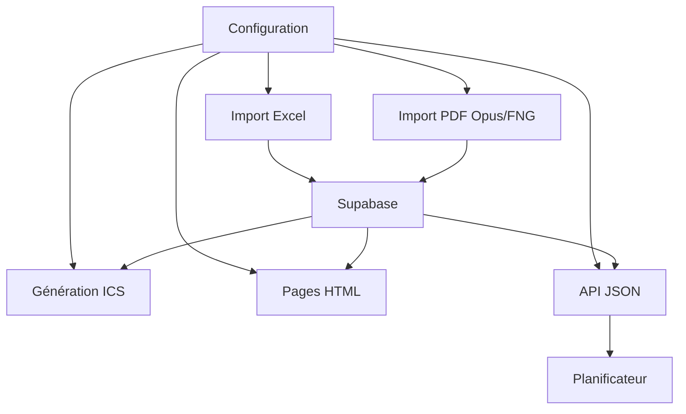

---

# 2. Configuration générale

## `log_msg(msg: str)`

Affiche un message dans les journaux Vercel.

### Paramètre

- `msg` : texte à afficher.

### Utilisée par

La majorité des fonctions d'import, d'API et de gestion des erreurs.

---

## Variables et objets globaux

### `supabase`

Client Supabase utilisé pour lire et écrire les données.

### `app`

Instance principale de `FastAPI`.

### `templates`

Instance `Jinja2Templates` utilisée pour rendre les pages HTML du dossier `templates`.

### `PARIS_TZ`

Fuseau horaire `Europe/Paris`, utilisé pour les dates, les calendriers ICS et l'affichage des mises à jour.

---

# 3. Fonctions de parsing de l'emploi du temps Excel

## `normalize_group_label(x)`

Normalise le nom d'un groupe.

### Exemples

```text
G1       -> G 1
G.2      -> G 2
Groupe 3 -> G 3
```

### Appelée par

- `parse_sheet_to_events_json`
- `normalized_event_groups`

---

## `is_time_like(x)`

Détermine si une valeur ressemble à une heure.

### Formats reconnus

```text
08:00
8h30
14H00
```

### Appelée par

- `parse_sheet_to_events_json`

---

## `to_time(x)`

Convertit une valeur en objet Python `time`.

### Valeurs acceptées

- `datetime.time`
- `datetime.datetime`
- `pandas.Timestamp`
- chaîne de caractères contenant une heure

### Appelée par

- `parse_sheet_to_events_json`

---

## `to_date(x)`

Convertit une valeur en objet Python `date`.

### Valeurs acceptées

- `datetime.date`
- `datetime.datetime`
- `pandas.Timestamp`
- chaîne de caractères contenant une date

### Appelée par

- `parse_sheet_to_events_json`

---

## `get_merged_map(xls_fileobj, sheet_name)`

Analyse les cellules fusionnées d'une feuille Excel.

La fonction produit un dictionnaire indiquant, pour chaque cellule appartenant à une zone fusionnée, les coordonnées complètes de cette fusion.

### Rôle

Déterminer si une séance concerne plusieurs groupes lorsque son contenu est fusionné sur plusieurs colonnes.

### Appelée par

- `parse_sheet_to_events_json`

---

## `find_week_rows(df)`

Recherche les lignes correspondant aux semaines.

### Valeurs reconnues

```text
S1
S. 2
3
```

### Appelée par

- `parse_sheet_to_events_json`

---

## `find_slot_rows(df)`

Recherche les lignes correspondant aux créneaux horaires.

### Valeurs reconnues

```text
H1
H2
H3
```

### Appelée par

- `parse_sheet_to_events_json`

---

## `parse_sheet_to_events_json(file_content: bytes, sheet_name: str)`

Fonction principale d'analyse d'une feuille d'emploi du temps.

### Entrées

- contenu binaire du fichier Excel ;
- nom de la feuille, généralement `EDT P1` ou `EDT P2`.

### Traitements

1. lit la feuille avec Pandas ;
2. récupère les cellules fusionnées avec OpenPyXL ;
3. repère les semaines ;
4. repère les créneaux ;
5. extrait les dates ;
6. extrait les matières ;
7. extrait les enseignants ;
8. extrait les horaires ;
9. détermine les groupes ;
10. fusionne les doublons ;
11. retourne une liste d'événements JSON.

### Sortie

```json
{
  "summary": "Nom de la matière",
  "teachers": ["NOM, Prénom"],
  "description": "Informations complémentaires",
  "start": "2026-09-01T08:00:00",
  "end": "2026-09-01T10:00:00",
  "groups": ["G 1", "G 2"]
}
```

### Appelée par

- `upload_excel`

### Dépendances internes

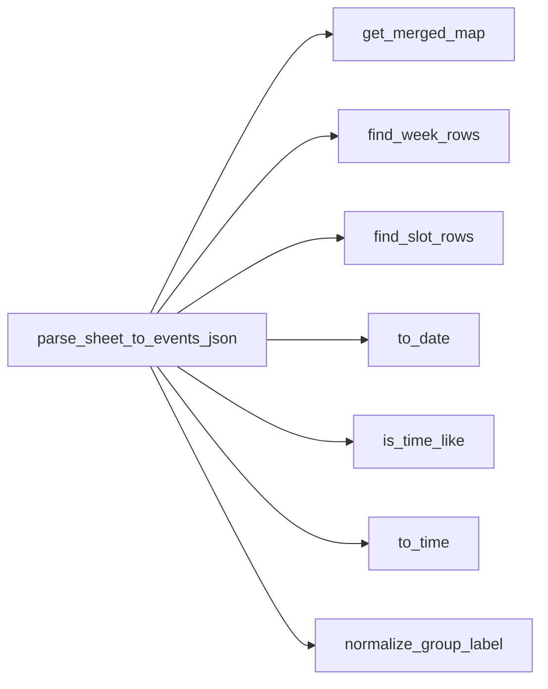

---

# 4. Conservation des salles entre deux imports Excel

## `normalize_event_datetime(value)`

Normalise une date et une heure d'événement à la minute.

### Rôle

Faire correspondre des dates provenant de sources différentes :

- nouvel import Excel ;
- événements déjà stockés ;
- dates avec ou sans fuseau horaire.

### Appelée par

- `preserve_rooms_from_existing_events`

---

## `normalized_event_groups(event: dict)`

Retourne les groupes normalisés d'un événement.

### Formats acceptés

```json
{"groups": ["G 1", "G.2"]}
```

ou :

```json
{"group": "G1"}
```

### Appelée par

- `preserve_rooms_from_existing_events`
- `room_target_matches_event`

---

## `get_event_room(event: dict)`

Retourne la salle d'un événement.

La fonction recherche successivement :

- `room`
- `location`

### Appelée par

- `preserve_rooms_from_existing_events`

---

## `preserve_rooms_from_existing_events(new_events, existing_events, promo_label="")`

Réinjecte les salles déjà enregistrées dans les événements issus d'un nouvel import Excel.

### Critères de correspondance

- même groupe ;
- même date et heure de début ;
- même date et heure de fin.

### Informations ignorées

- matière ;
- enseignant ;
- description.

### Appelée par

- `upload_excel`

### Cheminement

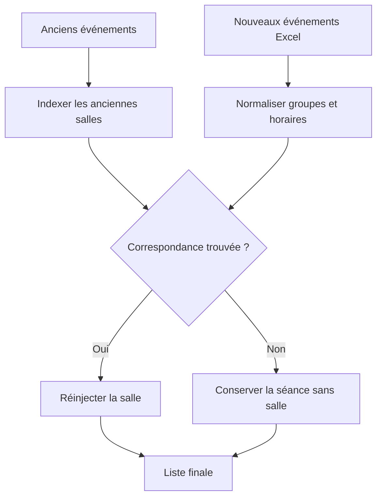

---

# 5. Parsing de la maquette pédagogique

## `parse_maquette_sheet(file_content: bytes)`

Analyse la feuille `Maquette`.

### Données extraites

- matière ;
- semestre ;
- unité d'enseignement ;
- enseignants ;
- CM/TD ;
- TP ;
- autonomie ;
- examen ;
- total ;
- commentaire ;
- coefficient.

### Particularités

- recherche automatiquement une feuille contenant le mot `maquette` ;
- propage le semestre et l'UE vers les lignes suivantes ;
- ignore certaines lignes non pédagogiques ;
- convertit les volumes horaires en nombres.

### Appelée par

- `upload_excel`

---

# 6. Parsing des enseignants

## `parse_teachers_sheet(file_content: bytes)`

Analyse la feuille `Enseignants`.

### Données extraites

- nom ;
- organisme ;
- adresse électronique ;
- tarif horaire effectif.

### Contrôles

- suppression des doublons ;
- validation simple du format de l'adresse électronique ;
- conversion du tarif en nombre.

### Appelée par

- `upload_excel`

---

# 7. Parsing des PDF Opus/FNG

## `clean_pdf_cell(value)`

Nettoie une cellule extraite d'un tableau PDF.

### Traitements

- remplace les retours à la ligne ;
- supprime les espaces multiples ;
- retourne une chaîne propre.

### Appelée par

La plupart des fonctions liées au PDF Opus/FNG.

---

## `parse_opus_date(value)`

Extrait une date depuis une cellule PDF.

### Formats reconnus

```text
01/09/26
01/09/2026
```

### Appelée par

- `row_looks_like_page_continuation`
- `parse_opus_pdf_rooms`

---

## `parse_opus_time(value)`

Extrait une heure depuis une cellule PDF.

### Particularité

Gère les minutes coupées entre plusieurs fragments, par exemple :

```text
12:3 0
```

### Appelée par

- `row_looks_like_event_fragment`
- `row_looks_like_page_continuation`
- `parse_opus_pdf_rooms`

---

## `normalize_room_label(value)`

Normalise le nom d'une salle.

### Appelée par

- `parse_opus_pdf_rooms`

---

## `parse_opus_targets(group_value: str)`

Convertit la désignation Opus/FNG en cible interne.

### Exemples

```text
Groupe session complète -> P1 et P2
Promo 1 Groupe 2        -> P1 / G 2
Promo 2                  -> toute la P2
```

### Appelée par

- `row_looks_like_page_continuation`
- `parse_opus_pdf_rooms`

---

## `merge_pdf_table_rows(left, right)`

Fusionne deux fragments d'une ligne PDF coupée entre deux pages.

### Appelée par

- `parse_opus_pdf_rooms`

---

## `is_opus_header_row(row)`

Détermine si une ligne correspond à l'en-tête du tableau PDF.

### Appelée par

- `row_looks_like_page_continuation`
- `parse_opus_pdf_rooms`

---

## `row_has_meaningful_text(row)`

Vérifie qu'une ligne contient au moins une information utile.

### Appelée par

- `parse_opus_pdf_rooms`

---

## `row_looks_like_event_fragment(row)`

Détermine si une ligne ressemble à un fragment de séance.

### Appelée par

- `row_looks_like_page_continuation`

---

## `row_looks_like_page_continuation(previous_row, current_row)`

Détecte si la première ligne d'une page complète la dernière ligne de la page précédente.

### Appelée par

- `parse_opus_pdf_rooms`

---

## `parse_opus_pdf_rooms(file_content: bytes)`

Fonction principale d'analyse du PDF Opus/FNG.

### Traitements

1. ouvre le PDF avec PDFPlumber ;
2. extrait les tableaux ;
3. nettoie les cellules ;
4. reconstitue les lignes coupées ;
5. identifie les créneaux ;
6. identifie les promotions et groupes ;
7. extrait les salles ;
8. regroupe les salles multiples ;
9. retourne les créneaux normalisés.

### Sortie

```json
{
  "start": "2026-09-01T08:00:00",
  "end": "2026-09-01T10:00:00",
  "promo": "p1",
  "subgroup": "G 1",
  "room": "A101",
  "pages": [1]
}
```

### Appelée par

- `inject_rooms_from_opus`

### Dépendances internes

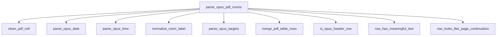

---

# 8. Rapprochement des salles avec les événements

## `parse_iso_datetime(value)`

Convertit une date ISO en objet `datetime`.

### Appelée par

- `calendar_bounds`
- `inject_rooms_into_events`

---

## `calendar_bounds(events_p1, events_p2)`

Retourne les dates minimale et maximale du calendrier.

### Rôle

Ignorer les salles du PDF situées hors de la période couverte par l'emploi du temps.

### Appelée par

- `inject_rooms_into_events`

---

## `room_target_matches_event(entry, event, promo)`

Vérifie que la cible du PDF correspond à la promotion et au groupe de la séance.

### Appelée par

- `inject_rooms_into_events`

---

## `intervals_are_compatible(opus_start, opus_end, event_start, event_end)`

Vérifie si deux créneaux sont compatibles.

### Cas acceptés

- créneaux identiques ;
- séance interne entièrement comprise dans un créneau Opus ;
- créneau Opus entièrement compris dans une séance interne.

### Appelée par

- `inject_rooms_into_events`

---

## `calendar_range_overlaps(entry_start, entry_end, calendar_start, calendar_end)`

Vérifie qu'un créneau PDF se situe dans la période du calendrier.

### Appelée par

- `inject_rooms_into_events`

---

## `inject_rooms_into_events(events_p1, events_p2, room_entries)`

Associe les salles extraites du PDF aux séances de P1 et P2.

### Principe

Seule la salle est modifiée. Les autres informations restent intactes.

### Résultat

La fonction retourne :

- les événements P1 mis à jour ;
- les événements P2 mis à jour ;
- le nombre de salles trouvées ;
- le nombre de salles utilisables ;
- le nombre d'événements mis à jour ;
- le nombre de salles non rapprochées.

### Appelée par

- `inject_rooms_from_opus`

### Cheminement

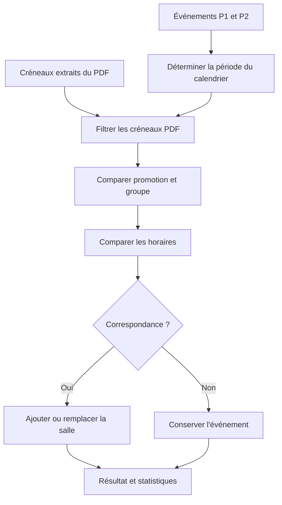

---

# 9. Génération des calendriers ICS

## `escape_ical_text(s: str)`

Échappe les caractères spéciaux requis par le format iCalendar.

### Caractères traités

- antislash ;
- retour à la ligne ;
- virgule ;
- point-virgule.

### Appelée par

- `events_to_ics_string`

---

## `build_paris_vtimezone_text()`

Construit le bloc `VTIMEZONE` pour le fuseau `Europe/Paris`.

### Appelée par

- `events_to_ics_string`

---

## `events_to_ics_string(events, tzname="Europe/Paris", uid_namespace="edt")`

Convertit une liste d'événements JSON en calendrier ICS.

### Traitements

1. génère un UID stable pour chaque séance ;
2. convertit les dates dans le fuseau Europe/Paris ;
3. construit le titre ;
4. ajoute la promotion et les groupes ;
5. ajoute la description ;
6. ajoute les enseignants ;
7. ajoute la salle ;
8. produit le document iCalendar complet.

### Appelée par

- `get_ics_file`
- `get_teacher_ics_file`

### Cheminement

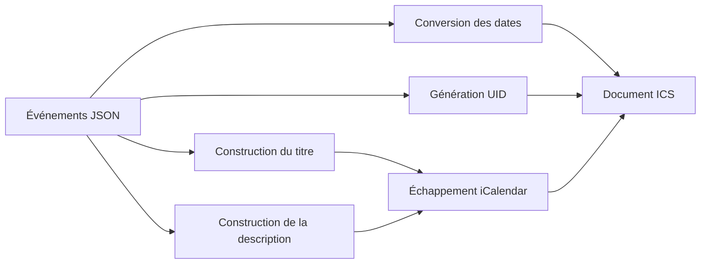

---

# 10. Authentification et sessions

## `get_current_user(request: Request)`

Retourne le nom de l'utilisateur stocké dans la session.

### Appelée par

Toutes les routes protégées.

---

## `hash_password(password: str)`

Calcule le hash SHA-256 d'un mot de passe.

### Appelée par

- `login_submit`
- `register_submit`

---

## `require_authenticated_user_for_api(request: Request)`

Vérifie l'authentification pour une API JSON.

Contrairement aux pages HTML, cette fonction retourne une erreur HTTP `401` au lieu d'une redirection.

### Appelée par

- `api_planner_data`
- `api_planner_save`

---

# 11. Fonctions utilitaires de présentation

## `convert_updated_at(plannings: list)`

Convertit la date `updated_at` dans le fuseau Europe/Paris.

### Appelée par

- `home`

---

# 12. Routes HTML

## `home(request, filter="my")`

Affiche la liste des plannings.

### Route

```text
GET /
```

### Appelle

- `get_current_user`
- `convert_updated_at`
- Supabase
- `index.html`

---

## `login_page(request)`

Affiche la page de connexion.

### Route

```text
GET /login
```

---

## `register_page(request)`

Affiche la page de création de compte.

### Route

```text
GET /register
```

---

## `login_submit(request, username, password)`

Vérifie les identifiants et crée la session.

### Route

```text
POST /login
```

### Appelle

- `hash_password`
- Supabase

---

## `register_submit(request, username, password, verification)`

Crée un compte utilisateur.

### Route

```text
POST /register
```

### Appelle

- `hash_password`
- Supabase

---

## `logout(request)`

Supprime la session et redirige vers la connexion.

### Route

```text
GET /logout
```

---

## `create_calendar(request, promo_name, school_year)`

Crée un nouveau planning dans Supabase.

### Route

```text
POST /create
```

---

## `view_calendar(slug, request)`

Affiche la vue publique du calendrier.

### Route

```text
GET /calendrier/{slug}
```

### Template

- `calendar_view.html`

---

## `view_dashboard(slug, request)`

Affiche le tableau de bord protégé.

### Route

```text
GET /dashboard/{slug}
```

### Template

- `dashboard.html`

---

## `view_planner(slug, request)`

Affiche le planificateur protégé.

### Route

```text
GET /planifier/{slug}
```

### Template

- `planner.html`

---

# 13. Routes d'import

## `upload_excel(slug, request, file)`

Importe un fichier Excel complet.

### Route

```text
POST /upload/{slug}
```

### Cheminement

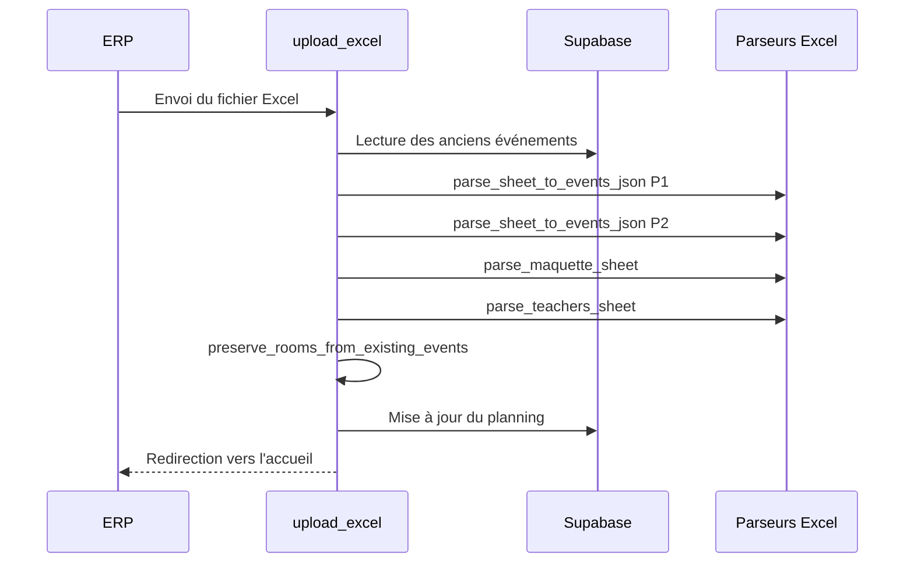

### Fonctions appelées

- `get_current_user`
- `parse_sheet_to_events_json`
- `parse_maquette_sheet`
- `parse_teachers_sheet`
- `preserve_rooms_from_existing_events`

---

## `inject_rooms_from_opus(slug, request, file)`

Importe un PDF Opus/FNG et met à jour les salles.

### Route

```text
POST /inject-rooms/{slug}
```

### Fonctions appelées

- `get_current_user`
- `parse_opus_pdf_rooms`
- `inject_rooms_into_events`

### Cheminement

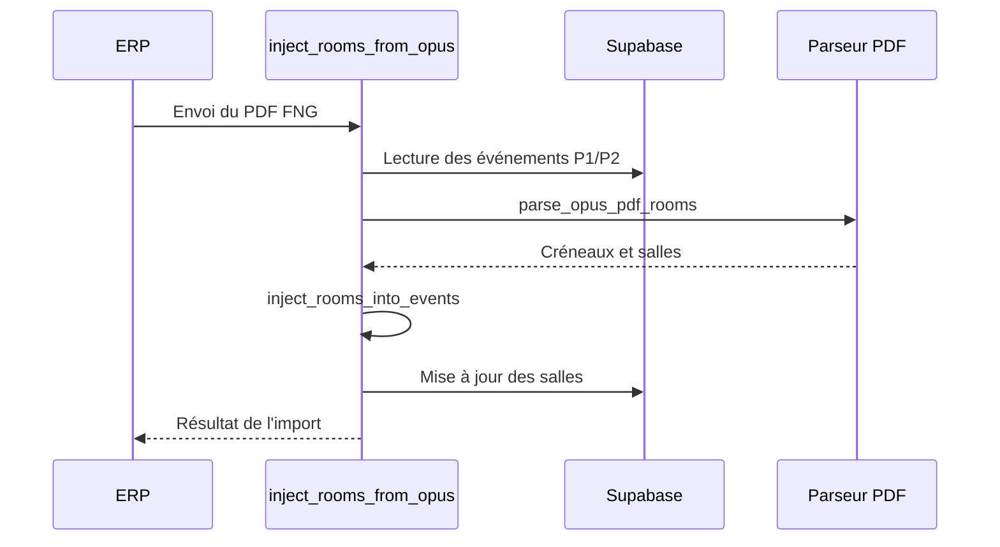

---

# 14. Routes ICS

## `get_ics_file(slug, group)`

Génère le calendrier ICS d'une promotion.

### Route

```text
GET /ics/{slug}/{group}.ics
```

### Groupes acceptés

- `P1`
- `P2`

### Appelle

- Supabase
- `events_to_ics_string`

---

## `get_teacher_ics_file(slug, teacher)`

Génère le calendrier ICS d'un enseignant.

### Route

```text
GET /ics/{slug}/enseignant.ics?teacher=...
```

### Particularité

Les événements P1 et P2 sont fusionnés. La promotion est ajoutée à chaque événement avant la génération du calendrier.

### Appelle

- Supabase
- `events_to_ics_string`

---

# 15. API JSON

## `api_planner_data(slug, request)`

Retourne toutes les données nécessaires au planificateur.

### Route

```text
GET /api/planner-data/{slug}
```

### Données retournées

- événements P1 ;
- événements P2 ;
- maquette ;
- enseignants.

---

## `api_planner_save(slug, request)`

Enregistre les modifications du planificateur.

### Route

```text
POST /api/planner-save/{slug}
```

### Champs acceptés

- `events_p1`
- `events_p2`
- `maquette_data`
- `teachers_data`

Les champs absents ne sont pas modifiés.

---

## `api_events(slug, group)`

Retourne les événements d'une promotion.

### Route

```text
GET /api/events/{slug}/{group}
```

---

## `api_maquette(slug)`

Retourne les données de la maquette pédagogique.

### Route

```text
GET /api/maquette/{slug}
```

---

## `api_dashboard_data(slug)`

Retourne en une seule requête les données utilisées par le tableau de bord.

### Route

```text
GET /api/dashboard-data/{slug}
```

### Données retournées

- événements P1 ;
- événements P2 ;
- maquette ;
- enseignants.

---

# 16. Cheminements complets

## Import Excel

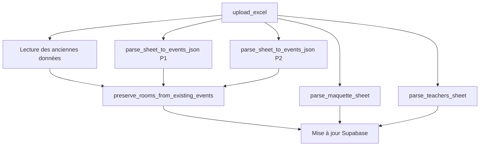

## Import des salles

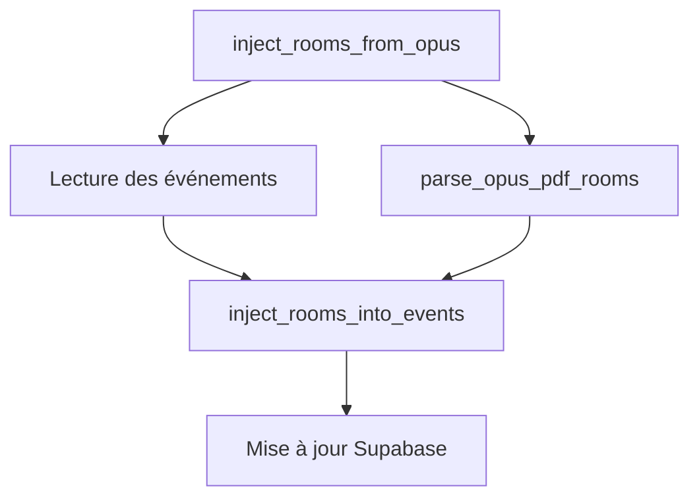

## Abonnement ICS

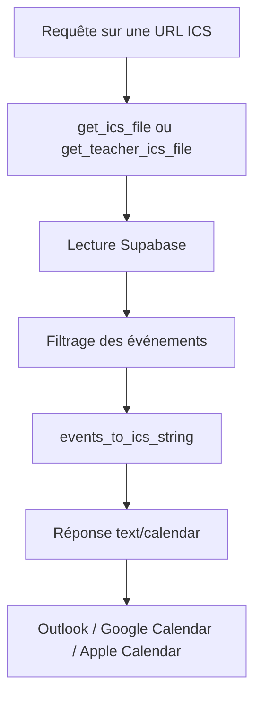

## Planificateur

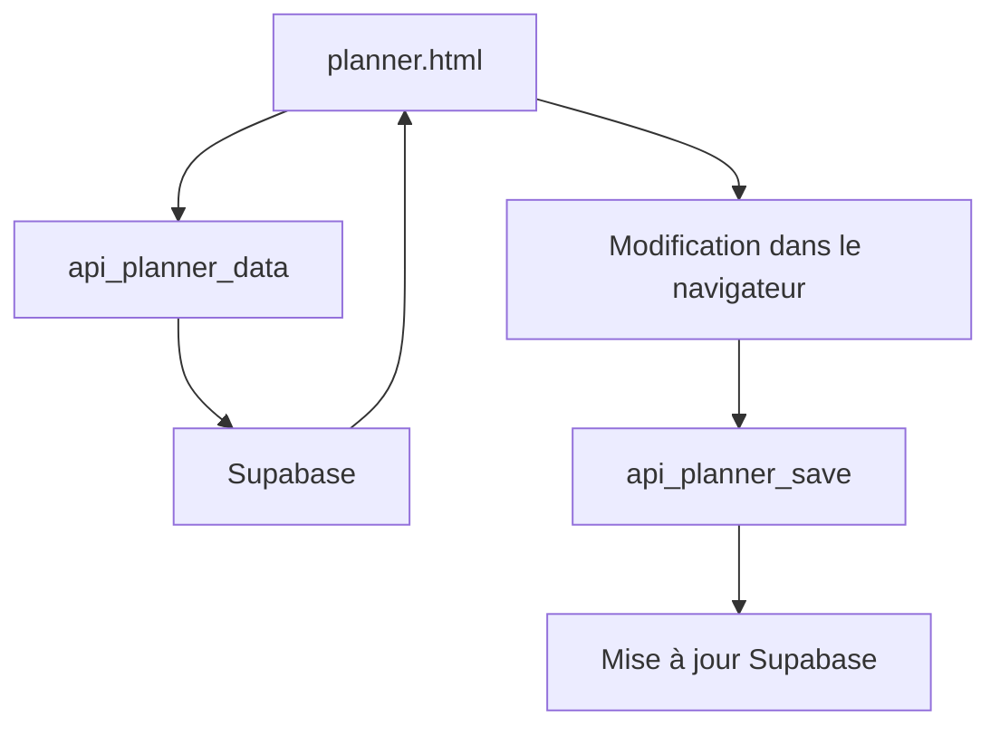

---

# 17. Graphe global des appels

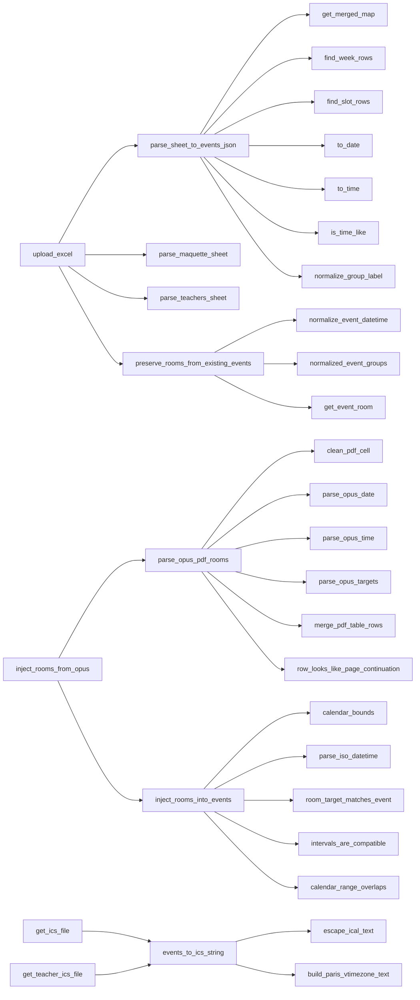

---

# 18. Résumé rapide

| Domaine | Fonction principale |
|---|---|
| Import EDT | `parse_sheet_to_events_json` |
| Maquette | `parse_maquette_sheet` |
| Enseignants | `parse_teachers_sheet` |
| PDF FNG | `parse_opus_pdf_rooms` |
| Injection des salles | `inject_rooms_into_events` |
| Conservation des salles | `preserve_rooms_from_existing_events` |
| Calendrier ICS | `events_to_ics_string` |
| Authentification | `get_current_user`, `hash_password` |
| Import global | `upload_excel` |
| Import des salles | `inject_rooms_from_opus` |
| Planificateur | `api_planner_data`, `api_planner_save` |
| Tableau de bord | `api_dashboard_data` |
