<p align="center">

</p>

# CESI-EDT

Plateforme web de gestion des emplois du temps développée pour CESI.

CESI-EDT permet aux **Enseignants Responsables Pédagogiques (ERP)** de gérer les emplois du temps des promotions, de diffuser les calendriers aux enseignants et aux étudiants, ainsi que de suivre différents indicateurs liés à la planification.

Les **enseignants** et les **étudiants** utilisent la plateforme pour consulter leur emploi du temps et s'abonner à leur calendrier personnel.

---

## Accès à la plateforme

La plateforme est accessible à l'adresse suivante :

👉 https://cesi-edt.vercel.app/

Aucune installation n'est nécessaire. Un navigateur web récent suffit.

<p align="center">
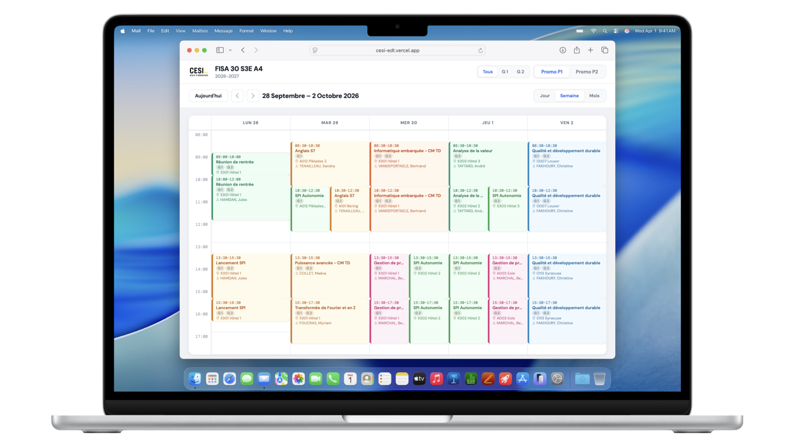
</p>

---

## Fonctionnalités

### Pour les ERP

- Gestion des promotions
- Import des emplois du temps
- Import des salles depuis les documents FNG
- Consultation et modification des plannings
- Gestion des examens
- Suivi des volumes horaires
- Génération des calendriers ICS
- Export des données
- Tableaux de bord et statistiques

### Pour les enseignants

- Consultation de leur emploi du temps
- Recherche rapide des séances
- Abonnement à leur calendrier (ICS)

### Pour les étudiants

- Consultation de l'emploi du temps de leur promotion
- Abonnement au calendrier (ICS)

---

# Guide d'utilisation pour l'ERP

## 1. Création d'une promotion

Créer une nouvelle promotion en renseignant les informations demandées (nom de la promotion, année académique, cycle, etc.).

Cette promotion servira de conteneur pour l'ensemble des données de planification.

---

## 2. Import de l'emploi du temps

Accéder au module **Import des emplois du temps**.

Importer le fichier Excel, l'emploi du temps normalisé rempli.

Une fois l'import terminé, vérifier que toutes les séances ont bien été créées.

---

## 3. Import des salles

Ouvrir le module **Import des salles**.

Importer les fichiers PDF issus de FNG contenant les affectations des salles.

La plateforme extrait automatiquement les salles et les associe aux séances correspondantes.

---

## 5. Consultation de l'emploi du temps

Utiliser les différents filtres pour afficher :

- une promotion ;
- un groupe ;
- un enseignant ;
- une salle.

Les modifications sont immédiatement visibles.

---

## 6. Gestion des examens

Accéder au module **Examens**.

Créer ou modifier les examens.

Vérifier l'absence de conflits de salles, d'horaires ou d'enseignants.

---

## 7. Suivi des heures

Le tableau de bord permet de consulter :

- les heures prévues ;
- les heures réalisées ;
- les écarts éventuels.

Ces informations peuvent être filtrées par enseignant ou par promotion.

---

## 8. Diffusion des calendriers

Une fois les vérifications terminées, récupérer les liens d'abonnement ICS.

Chaque enseignant et chaque promotion disposent de leur propre calendrier.

Les utilisateurs peuvent ensuite s'abonner à leur calendrier depuis Outlook, Google Calendar, Apple Calendar ou toute autre application compatible.

<p align="center">
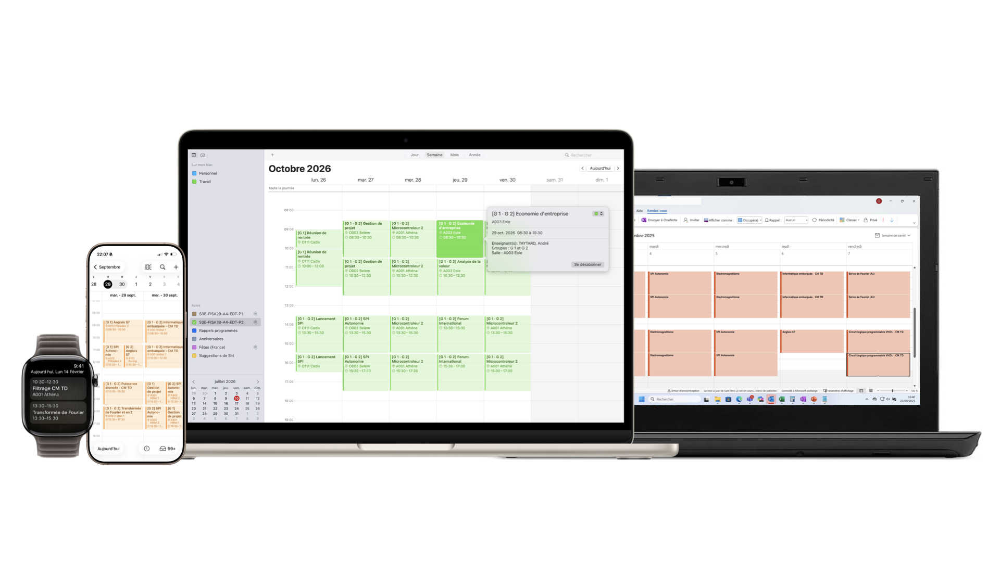
</p>

---

## 9. Export des données

La plateforme permet d'exporter différents éléments :

- calendriers ICS ;
- tableaux récapitulatifs ;
- statistiques.

---

---

# Architecture technique

CESI-EDT est une application web développée principalement en **Python**.

Le serveur repose sur **FastAPI**. Il prend en charge :

- les pages web ;
- l’authentification ;
- les API JSON ;
- l’import des fichiers Excel ;
- l’analyse des PDF issus de FNG ;
- la génération des calendriers ICS ;
- la lecture et l’enregistrement des données dans Supabase.

Les pages sont générées à partir de modèles HTML avec **Jinja2**. L’application est déployée sur **Vercel** et utilise **Supabase** pour la persistance des données.

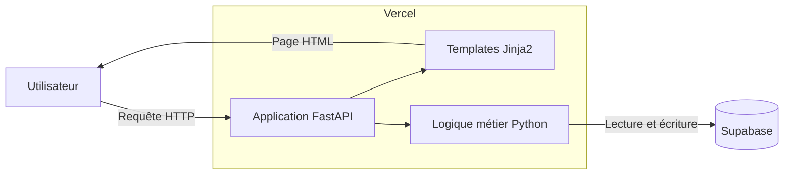

---

## Organisation du projet

```text
CESI-EDT/
│
├── api/
│   └── main.py
│
├── templates/
│   ├── calendar_view.html
│   ├── dashboard.html
│   ├── index.html
│   ├── login.html
│   └── planner.html
│
├── static/
│   └── cesi.png
│
├── readme-assets/
│   ├── cesi-edt-readme.001.png
│   ├── cesi-edt-readme.002.png
│   └── hello.png
│
├── README.md
├── requirements.txt
└── vercel.json
```

### `api/main.py`

Le fichier `api/main.py` constitue le cœur de l’application.

Il contient :

- la configuration de FastAPI ;
- la connexion à Supabase ;
- la gestion des sessions ;
- les fonctions d’analyse des fichiers Excel ;
- les fonctions d’analyse des PDF FNG ;
- la génération des fichiers ICS ;
- les routes publiques ;
- les routes protégées ;
- les API utilisées par le planificateur et les tableaux de bord.

### `templates/`

Le dossier `templates` contient les pages HTML rendues par Jinja2.

| Fichier | Rôle |
|---|---|
| `index.html` | Accueil et gestion des promotions |
| `login.html` | Connexion et création de compte |
| `dashboard.html` | Tableau de bord pédagogique |
| `planner.html` | Modification interactive des emplois du temps |
| `calendar_view.html` | Consultation publique d’un emploi du temps |

### `static/`

Le dossier `static` contient les ressources statiques utilisées par l’application, notamment les images et les éléments graphiques.

### `readme-assets/`

Le dossier `readme-assets` contient les captures d’écran et les illustrations utilisées uniquement dans le présent README.

### `requirements.txt`

Ce fichier liste les dépendances Python nécessaires à l’exécution de l’application.

### `vercel.json`

Ce fichier configure le déploiement de l’application FastAPI sur Vercel.

---

## Organisation interne du code Python

Le fichier principal est structuré en plusieurs blocs fonctionnels.

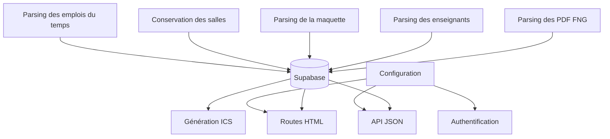

---

## Import de l’emploi du temps Excel

L’emploi du temps est importé depuis le fichier Excel normalisé.

Le traitement repose sur **Pandas** et **OpenPyXL**.

L’application recherche notamment les feuilles :

- `EDT P1` ;
- `EDT P2` ;
- `Maquette` ;
- `Enseignants`.

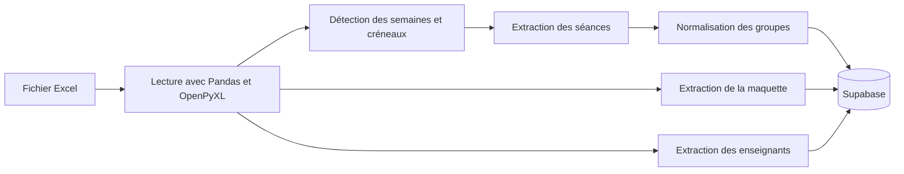

Pour chaque séance, l’application extrait notamment :

- la matière ;
- la date ;
- l’heure de début ;
- l’heure de fin ;
- le ou les groupes ;
- le ou les enseignants ;
- la description éventuelle.

Les séances identiques présentes dans plusieurs cellules sont regroupées afin d’éviter les doublons.

---

## Conservation des salles lors d’un nouvel import

Lorsqu’un nouvel emploi du temps Excel est importé, les séances existantes sont remplacées.

Cependant, les salles précédemment ajoutées depuis le PDF FNG sont conservées lorsque les éléments suivants correspondent :

- le groupe ;
- la date et l’heure de début ;
- la date et l’heure de fin.

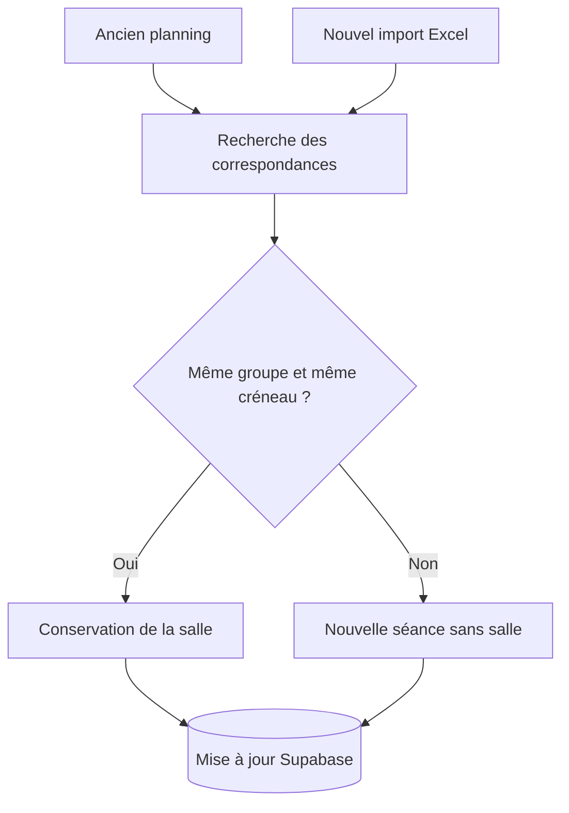

Le nom de la matière et les enseignants ne sont pas utilisés pour cette correspondance. Cela permet de conserver une salle même lorsqu’une matière ou une affectation d’enseignant a été modifiée dans le nouvel Excel.

---

## Import des salles depuis FNG

Les salles sont importées depuis les PDF issus de FNG à l’aide de **PDFPlumber**.

L’application extrait uniquement les informations utiles :

- la promotion ;
- le groupe ;
- la date ;
- l’heure de début ;
- l’heure de fin ;
- la salle.

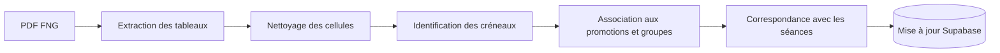

Le parseur gère également certains cas particuliers :

- cellules coupées sur plusieurs lignes ;
- lignes poursuivies sur une page suivante ;
- salles multiples pour un même créneau ;
- créneau FNG couvrant plusieurs séances successives ;
- distinction entre P1, P2 et leurs différents groupes.

Lorsqu’une correspondance est trouvée, seule la salle est modifiée. La matière, les enseignants et les autres informations de la séance restent inchangés.

---

## Données de maquette pédagogique

La feuille `Maquette` est analysée afin d’extraire les informations pédagogiques nécessaires au tableau de bord.

Les données extraites comprennent notamment :

- le semestre ;
- l’unité d’enseignement ;
- la matière ;
- les enseignants ;
- les heures de CM/TD ;
- les heures de TP ;
- les heures d’autonomie ;
- les heures d’examen ;
- le volume horaire total ;
- le coefficient ;
- les commentaires.


---

## Données des enseignants

La feuille `Enseignants` permet d’importer les informations utilisées pour le suivi pédagogique et financier.

L’application peut notamment extraire :

- le nom ;
- l’organisme ;
- l’adresse électronique ;
- le tarif horaire effectif.

Les doublons sont ignorés et les adresses électroniques sont vérifiées avant leur enregistrement.

---

## Génération des calendriers ICS

CESI-EDT génère des calendriers au format **ICS**, conforme au standard iCalendar.

Des flux distincts sont disponibles pour :

- la promotion P1 ;
- la promotion P2 ;
- chaque enseignant.

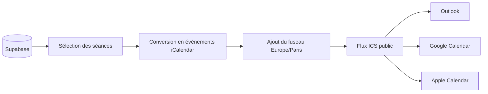

Chaque événement ICS contient notamment :

- un identifiant stable ;
- le titre de la séance ;
- la promotion ;
- le groupe ;
- les horaires ;
- l’enseignant ;
- la salle ;
- la description.

Les flux d’abonnement sont générés dynamiquement à partir des données enregistrées dans Supabase. Une modification effectuée par l’ERP est donc répercutée dans les applications de calendrier lors de leur prochaine actualisation.

---

## Authentification

Les interfaces d’administration sont protégées par une authentification avec session.

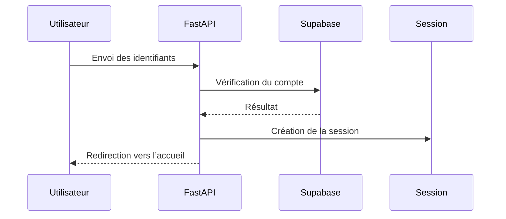

Les pages suivantes nécessitent une authentification :

- gestion des promotions ;
- import des fichiers ;
- tableau de bord ;
- planificateur ;
- API d’enregistrement des modifications.

La consultation publique des calendriers et les flux ICS ne nécessitent pas de connexion.

---

## Routes principales

### Routes HTML

| Route | Description | Accès |
|---|---|---|
| `/` | Liste et gestion des promotions | Protégé |
| `/login` | Connexion | Public |
| `/register` | Création d’un compte | Public |
| `/dashboard/{slug}` | Tableau de bord | Protégé |
| `/planifier/{slug}` | Planificateur | Protégé |
| `/calendrier/{slug}` | Consultation du planning | Public |

### Routes d’import

| Route | Description |
|---|---|
| `/create` | Création d’une promotion |
| `/upload/{slug}` | Import du fichier Excel |
| `/inject-rooms/{slug}` | Import des salles depuis un PDF FNG |

### Routes ICS

| Route | Description |
|---|---|
| `/ics/{slug}/P1.ics` | Calendrier de P1 |
| `/ics/{slug}/P2.ics` | Calendrier de P2 |
| `/ics/{slug}/enseignant.ics?teacher=...` | Calendrier d’un enseignant |

### API JSON

| Route | Description |
|---|---|
| `/api/events/{slug}/{group}` | Événements de P1 ou P2 |
| `/api/maquette/{slug}` | Données de la maquette |
| `/api/dashboard-data/{slug}` | Données complètes du tableau de bord |
| `/api/planner-data/{slug}` | Données nécessaires au planificateur |
| `/api/planner-save/{slug}` | Enregistrement des modifications |

---

## Fonctionnement du planificateur

La page `planner.html` récupère les données depuis une API FastAPI.

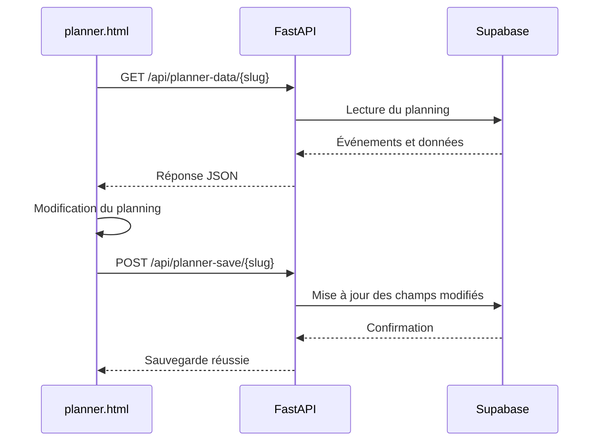

L’API accepte la mise à jour séparée de plusieurs ensembles de données :

- `events_p1` ;
- `events_p2` ;
- `maquette_data` ;
- `teachers_data`.

Les champs absents de la requête ne sont pas modifiés.

---

## Stockage des données

Supabase est utilisé comme service de persistance.

Deux ensembles de données principaux sont manipulés :

### Utilisateurs

Les comptes permettent d’accéder aux interfaces réservées aux ERP.

### Plannings

Chaque planning est identifié par un `slug` et contient notamment :

```text
slug
name
year
creator
updated_at
events_p1
events_p2
maquette_data
teachers_data
```

Les événements et les données pédagogiques sont enregistrés sous forme de structures JSON.

Cette organisation permet de charger l’ensemble des informations d’une promotion en un nombre limité de requêtes.

---

## Déploiement

CESI-EDT est déployé sur **Vercel**.

Le fichier `vercel.json` indique à Vercel comment exécuter l’application FastAPI située dans `api/main.py`.

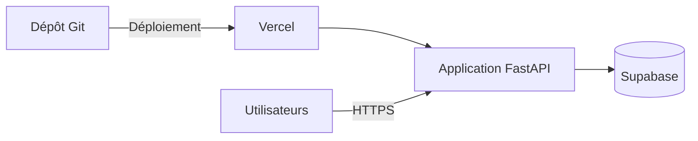

L’architecture ne nécessite pas de serveur géré manuellement. Vercel prend en charge l’hébergement et l’exposition de l’application en HTTPS.

---

## Technologies

### Backend

- Python
- FastAPI
- Starlette
- Jinja2

### Traitement des données

- Pandas
- OpenPyXL
- PDFPlumber
- python-dateutil
- pytz

### Base de données

- Supabase

### Formats pris en charge

- Excel
- PDF
- JSON
- ICS

### Hébergement

- Vercel

---

## Auteur

Projet développé par Jules Hamdan, ERP à CESI Toulouse, pour les équipes pédagogiques de CESI afin de simplifier la gestion des emplois du temps et la diffusion des calendriers.
